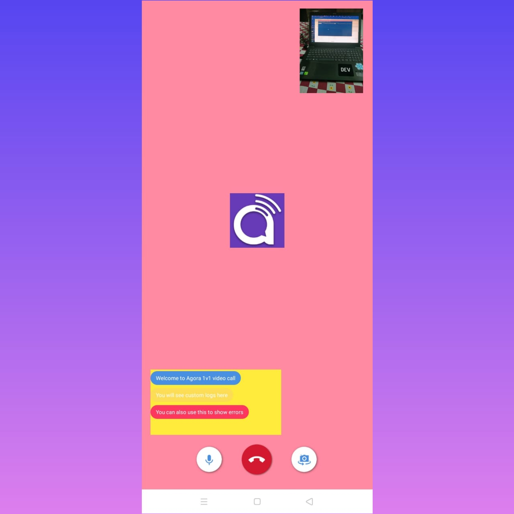
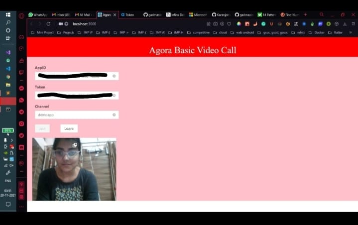


# Agora Demo App for 1:1 Voice and video calling ⚡️

With this sample app, you can:

- Join / leave channel
- Mute / unmute audio
- Switch camera
- Setup resolution, frame rate and bit rate






## Contributions and PR

 - PRs should be generated against `master`


# Web Tutorial For React & Basic Video Call

## Prerequisites

- nodejs LTS
- A web browser

### Obtain an App ID

To build and run the sample application, get an App ID:
1. Create a developer account at [agora.io](https://dashboard.agora.io/signin/). Once you finish the signup process, you will be redirected to the Dashboard.

2. Navigate in the Dashboard tree on the left to **Projects** > **Project List**.

3. Save the **App ID** from the Dashboard for later use.

4. Generate a temp **Access Token** (valid for 24 hours) from dashboard page with given channel name, save for later use.

   > To ensure communication security, Agora uses tokens (dynamic keys) to authenticate users joining a channel.
   >
   > Temporary tokens are for demonstration and testing purposes only and remain valid for 24 hours. In a production environment, you need to deploy your own server for generating tokens. See [Generate a Token](https://docs.agora.io/en/Interactive Broadcast/token_server)for details.


### Install dependencies and integrate the Agora Video SDK

1. Using the Terminal app, enter the `install` command in your project directory. This command installs libraries that are required to run the sample application.
    ``` 
    npm install
    ```
2. Start the application by entering the `start` command.
    ``` 
    npm start
    ```
    Run app <br/> in development mode
    Go to [http://localhost:3000](http://localhost:3000) and view it in a browser.

    If you edit, the page will reload. < br / >
    You will also see any lint errors in the console.

    The `run build` command is for production purposes and minifies code.
    ``` 
    npm run build
    ```


# Android 1-to-1 Tutorial


## Prerequisites

- Android Studio 3.3 or above
- Android device (e.g. Nexus 5X). A real device is recommended because some simulators have missing functionality or lack the performance necessary to run the sample.

## Quick Start

This section shows you how to prepare, build, and run the sample application.

### Obtain an App ID

To build and run the sample application, get an App ID:
1. Create a developer account at [agora.io](https://dashboard.agora.io/signin/). Once you finish the signup process, you will be redirected to the Dashboard.
2. Navigate in the Dashboard tree on the left to **Projects** > **Project List**.
3. Save the **App ID** from the Dashboard for later use.
4. Generate a temp **Access Token** (valid for 24 hours) from dashboard page with given channel name, save for later use.

5. Locate the file **app/src/main/res/values/strings.xml** and replace <#YOUR APP ID#> with the App ID in the dashboard.

  ```xml
  <string name="agora_app_id"><#YOUR APP ID#></string>
  <!-- Obtain a temp Access Token at https://dashboard.agora.io -->
  <!-- You will need to deploy your own token server for production release -->
  <!-- Leave this value empty if Security keys/Token is not enabled for your project -->
  <string name="agora_access_token"><#YOUR TOKEN#></string>
  ```

> To ensure communication security, Agora uses tokens (dynamic keys) to authenticate users joining a channel.
>
> Temporary tokens are for demonstration and testing purposes only and remain valid for 24 hours. In a production environment, you need to deploy your own server for generating tokens. See [Generate a Token](https://docs.agora.io/en/Interactive Broadcast/token_server)for details.

### Integrate the Agora Video SDK

The SDK must be integrated into the sample project before it can opened and built. There are two methods for integrating the Agora Video SDK into the sample project. The first method uses JCenter to automatically integrate the SDK files. The second method requires you to manually copy the SDK files to the project.

#### Method 1 - Integrate the SDK Automatically Using JCenter (Recommended)

1. Clone this repository.
2. Open **app/build.gradle** and add the following line to the `dependencies` list:

  ```
  ...
  dependencies {
      ...
      implementation 'io.agora.rtc:full-sdk:3.0.0'
  }
  ```

#### Method 2 - Manually copy the SDK files

1. Download the Agora Video SDK from [Agora.io SDK](https://www.agora.io/en/download/).
2. Unzip the downloaded SDK package.
3. Copy the following files from the **libs** folder of the downloaded SDK package:

Copy from SDK|Copy to Project Folder
---|---
.jar file|**/apps/libs** folder
**arm64-v8a** folder|**/app/src/main/jniLibs** folder
**x86** folder|**/app/src/main/jniLibs** folder
**armeabi-v7a** folder|**/app/src/main/jniLibs** folder

​    

### Run the Application

Open project with Android Studio, connect your Android device, build and run.
      
Or use `Gradle` to build and run.
